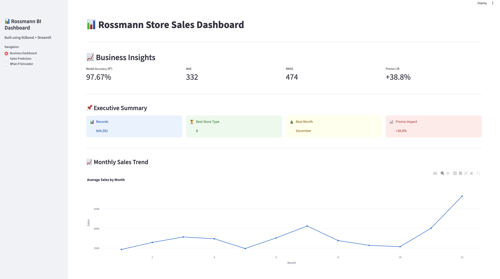
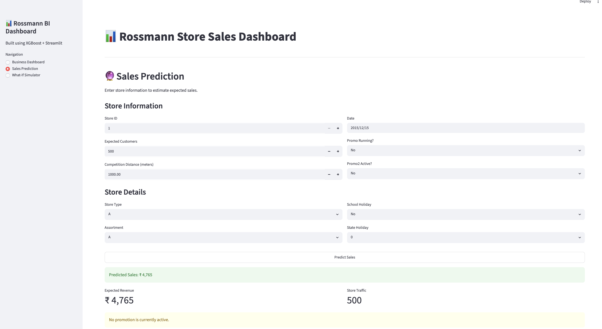
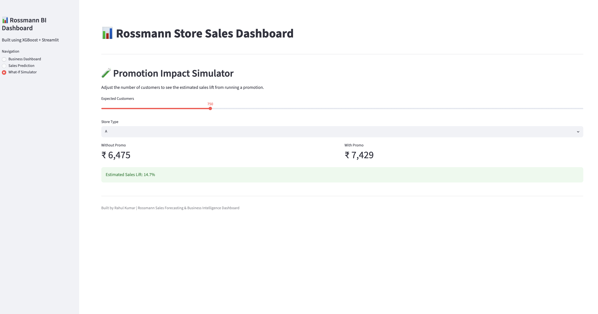

# 📊 Rossmann Sales Forecasting & Business Intelligence Dashboard

## 🚀 Project Overview

This project focuses on forecasting daily sales for Rossmann retail stores using machine learning and business analytics techniques.

The goal is to identify the key business drivers affecting sales, build a highly accurate forecasting model, and create an interactive dashboard that allows users to predict future sales and explore business insights.

The project combines:

* Exploratory Data Analysis (EDA)
* Feature Engineering
* Machine Learning (XGBoost)
* Business Intelligence
* Interactive Dashboard Development using Streamlit

---

## 🎯 Business Problem

Retail companies need accurate sales forecasts to:

* Optimize inventory planning
* Improve promotional strategies
* Allocate workforce efficiently
* Increase revenue and profitability
* Make data-driven business decisions

This project predicts store sales using store information, promotions, competition data, holidays, customer traffic, and temporal features.

---

## 📂 Dataset

Rossmann Store Sales Dataset

Files Used:

* train.csv
* test.csv
* store.csv

Key Features:

| Feature             | Description                    |
| ------------------- | ------------------------------ |
| Store               | Store ID                       |
| Customers           | Number of customers            |
| Promo               | Promotional campaign status    |
| Promo2              | Ongoing promotional program    |
| CompetitionDistance | Distance to nearest competitor |
| SchoolHoliday       | School holiday indicator       |
| StateHoliday        | State holiday indicator        |
| StoreType           | Type of store                  |
| Assortment          | Product assortment level       |

---

## 🔍 Exploratory Data Analysis

### Monthly Sales Trend

* December recorded the highest average sales.
* Sales remained relatively stable throughout the year.
* Seasonal uplift observed during festive months.

### Yearly Sales Trend

| Year | Average Sales |
| ---- | ------------: |
| 2013 |         5,659 |
| 2014 |         5,833 |
| 2015 |         5,878 |

Sales showed consistent growth over the observed period.

### Correlation Analysis

| Feature       | Correlation with Sales |
| ------------- | ---------------------: |
| Customers     |                  0.895 |
| Open          |                  0.678 |
| Promo         |                  0.452 |
| SchoolHoliday |                  0.085 |
| Month         |                  0.049 |
| Quarter       |                  0.044 |
| Year          |                  0.024 |
| DayOfWeek     |                 -0.462 |
| IsWeekend     |                 -0.450 |

Key Findings:

* Customer count is the strongest sales driver.
* Promotions positively influence sales.
* Weekends generally produce lower sales than weekdays.

---

## ⚙️ Feature Engineering

Several business-oriented features were created:

### Date Features

* Year
* Month
* Day
* Quarter
* DayOfWeek
* IsWeekend

### Competition Features

* CompetitionAge

### Promotion Features

* PromoAge

### Encoded Features

* StoreType
* Assortment
* StateHoliday
* PromoInterval

Final Dataset Shape:

844,392 rows × 32 columns

---

## 🤖 Machine Learning Model

### Algorithm

XGBoost Regressor

Reasons for Selection:

* Handles non-linear relationships effectively
* Excellent performance on tabular business data
* Robust to feature interactions
* High predictive accuracy

---

## 📈 Model Performance

| Metric   |  Score |
| -------- | -----: |
| R² Score | 0.9767 |
| MAE      | 331.98 |
| RMSE     | 474.45 |

### Interpretation

* Model explains approximately 97.67% of sales variation.
* Average prediction error is only ₹332.
* Strong generalization performance on unseen data.

---

## 🔥 Top Business Drivers

| Feature             | Importance |
| ------------------- | ---------: |
| Assortment_b        |     0.2336 |
| Customers           |     0.2273 |
| StoreType_d         |     0.1536 |
| StoreType_b         |     0.1132 |
| Promo               |     0.0487 |
| Assortment_c        |     0.0226 |
| Promo2              |     0.0218 |
| CompetitionDistance |     0.0203 |

Business Insight:

Customer traffic and store configuration have a significantly higher impact on sales than competition distance.

---

## 🖥️ Streamlit Dashboard

The project includes an interactive dashboard with:

### Business Dashboard

* Model performance metrics
* Feature importance visualization
* Business insights and findings

### Sales Prediction Tool

Users can:

* Select date
* Enter expected customer count
* Configure store details
* Specify promotional campaigns
* Predict expected sales instantly

---

## 📸 Dashboard Screenshots

### Business Dashboard



### Sales Prediction Page



### Sales Prediction Result



---

## 🛠️ Tech Stack

### Programming

* Python

### Data Analysis

* Pandas
* NumPy

### Visualization

* Matplotlib
* Seaborn
* Plotly

### Machine Learning

* XGBoost
* Scikit-Learn

### Deployment

* Streamlit

---

## 📁 Project Structure

```text
Rossmann-Sales-Forecasting/
│
├── app.py
├── README.md
├── requirements.txt
│
├── models/
│   ├── xgb_model.pkl
│   └── features.pkl
│
├── data/
│   ├── store.csv
│   └── feature_importance.csv
│
├── notebooks/
│   └── Rossmann_EDA_and_Modeling.ipynb
│
├── screenshots/
│   ├── business_dashboard.png
│   ├── sales_prediction_page.png
│   └── sales_prediction_result.png
│
└── images/
```

---

## ▶️ Run Locally

Clone the repository:

```bash
git clone https://github.com/jkrahu2005/Rossmann-Sales-Forecasting.git
```

Install dependencies:

```bash
pip install -r requirements.txt
```

Run the dashboard:

```bash
streamlit run app.py
```

