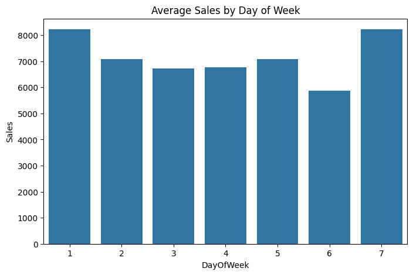
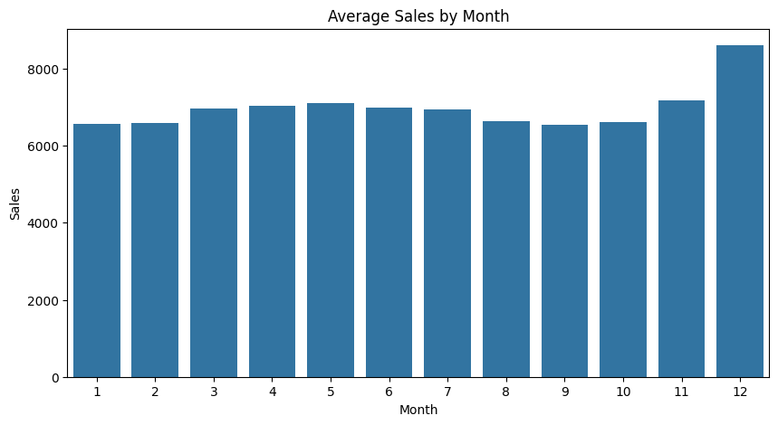
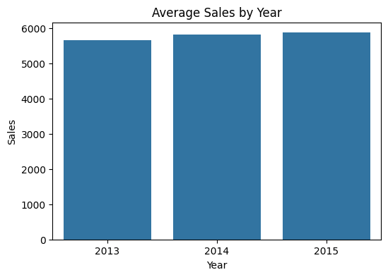

 ## Missing Value Analysis:
The merged dataset contains missing values primarily in promotion-related and competition-related features. Approximately 50% of stores do not participate in the Promo2 program, resulting in missing values in Promo2 start date attributes. Competition-related features contain around 32% missing values, while CompetitionDistance has less than 1% missing data.

Analysis of store operating status revealed that all closed stores generated zero sales. Approximately 17% of records corresponded to closed stores. Since these observations do not contribute to learning customer demand patterns, they were removed before model training.

### Promotion Impact Analysis

- Average sales without promotion: **5,929**
- Average sales with promotion: **8,228**
- Stores running promotions generated significantly higher sales.

**Insight:** Promotional campaigns positively impact store revenue and are an important driver of sales performance.

### Store Type Analysis

| Store Type | Average Sales |
|:----------:|-------------:|
| B          | 10,231       |
| C          | 6,933        |
| A          | 6,925        |
| D          | 6,822        |

- Store Type **B** generated the highest average sales.
- Store Types **A, C, and D** showed similar sales performance.
- Store type has a significant impact on revenue and should be retained as an important feature for forecasting.

**Insight:** Store Type B stores are the most profitable and outperform other store categories by a large margin.

### Day of Week Analysis

| Day of Week | Average Sales |
|:-----------:|-------------:|
| 1           | 8,216        |
| 2           | 7,088        |
| 3           | 6,728        |
| 4           | 6,767        |
| 5           | 7,073        |
| 6           | 5,875        |
| 7           | 8,225        |

### Average Sales by Day of Week

**Key Findings:**
- Day 7 recorded the highest average sales (~8,225).
- Day 1 also showed strong sales performance (~8,216).
- Day 6 recorded the lowest average sales (~5,875).
- Sales exhibit a clear weekly pattern.

**Insight:** Customer purchasing behavior varies significantly across the week, making `DayOfWeek` an important feature for sales forecasting.

### Monthly Sales Analysis

| Month | Average Sales |
|:-----:|-------------:|
| Jan   | 6,564 |
| Feb   | 6,589 |
| Mar   | 6,976 |
| Apr   | 7,046 |
| May   | 7,106 |
| Jun   | 7,001 |
| Jul   | 6,953 |
| Aug   | 6,649 |
| Sep   | 6,546 |
| Oct   | 6,603 |
| Nov   | 7,189 |
| Dec   | 8,609 |
**Key Findings:**
- December recorded the highest average sales (8,609).
- November also exhibited strong sales performance.
- September recorded the lowest average sales.
- Sales display clear seasonal trends throughout the year.

**Insight:** Seasonal factors strongly influence store revenue. The significant increase in sales during November and December suggests holiday shopping effects, making `Month` a critical feature for forecasting.

### Yearly Sales Analysis

| Year | Average Sales |
|-----:|-------------:|
| 2013 | 5,659 |
| 2014 | 5,833 |
| 2015 | 5,878 |

**Key Findings:**
- Average sales increased steadily from 2013 to 2015.
- No major decline in sales was observed.
- The business maintained positive growth throughout the available period.

**Insight:** The upward sales trend indicates healthy business performance and increasing customer demand over time. `Year` is likely to be a useful feature for forecasting future sales.

### Missing Value Treatment

The dataset contained missing values in competition and promotion-related features.

| Feature                     | Missing Values | Treatment              |
|-----------------------------|---------------:|------------------------|
| CompetitionDistance         |          2,642 | Filled with median     |
| CompetitionOpenSinceMonth   |        323,348 | Filled with 0          |
| CompetitionOpenSinceYear    |        323,348 | Filled with 0          |
| Promo2SinceWeek             |        508,031 | Filled with 0          |
| Promo2SinceYear             |        508,031 | Filled with 0          |
| PromoInterval               |        508,031 | Filled with "None"     |

**Reasoning:**
- Missing promotion information indicates that the store was not participating in a continuous promotion program.
- Missing competition information indicates unavailable competitor data.
- Median imputation was used for `CompetitionDistance` to minimize the impact of outliers.

**Result:** All missing values were successfully handled before feature engineering and model training.

### Feature Engineering

The following business-oriented features were created to improve forecasting performance:

| Feature | Description |
|----------|-------------|
| Quarter | Quarter of the year (Q1–Q4) |
| IsWeekend | Indicates whether the observation falls on a weekend |
| CompetitionAge | Number of days since the nearest competitor opened |
| PromoAge | Number of days since the continuous promotion started |

**Business Value:**
- Quarterly patterns capture seasonal demand variations.
- Weekend indicators capture customer shopping behavior.
- Competition age helps quantify competitive pressure.
- Promotion age measures the long-term effect of promotional campaigns.

These engineered features provide additional business context beyond the raw dataset and improve the model's ability to forecast sales.

### Correlation Analysis

The relationship between numerical features and sales was analyzed using Pearson correlation.

| Feature | Correlation with Sales |
|-------------------------|----------------------:|
| Customers | 0.895 |
| Open | 0.678 |
| Promo | 0.452 |
| SchoolHoliday | 0.085 |
| Month | 0.049 |
| Quarter | 0.044 |
| Year | 0.024 |
| DayOfWeek | -0.462 |
| IsWeekend | -0.450 |

**Key Findings:**
- Customer count showed the strongest positive correlation with sales.
- Promotional activities had a significant positive impact on revenue.
- Store opening status strongly influenced sales performance.
- Day of week and weekend indicators exhibited notable negative relationships with sales.

**Insight:** Customer footfall, promotions, and store operating status are the primary drivers of revenue in the Rossmann dataset.

### Correlation Analysis

The relationship between numerical features and sales was analyzed using Pearson correlation.

| Feature        | Correlation with Sales |
|:---------------|----------------------:|
| Customers      | 0.895 |
| Open           | 0.678 |
| Promo          | 0.452 |
| SchoolHoliday  | 0.085 |
| Month          | 0.049 |
| Quarter        | 0.044 |
| Year           | 0.024 |
| DayOfWeek      | -0.462 |
| IsWeekend      | -0.450 |

**Key Findings:**
- Customer count showed the strongest positive correlation with sales.
- Promotional activities had a significant positive impact on revenue.
- Store opening status strongly influenced sales performance.
- Day of week and weekend indicators exhibited notable negative relationships with sales.

**Insight:** Customer footfall, promotions, and store operating status are the primary drivers of revenue in the Rossmann dataset.

### Categorical Feature Encoding

Categorical variables were transformed into numerical representations using One-Hot Encoding.

Encoded Features:
- StoreType
- Assortment
- StateHoliday
- PromoInterval

One-Hot Encoding was chosen because tree-based algorithms such as XGBoost require numerical inputs and can effectively utilize binary indicator variables.

The `drop_first=True` option was used to avoid redundant columns and reduce multicollinearity.

### Train-Test Split

The dataset was divided into training and testing sets.

| Dataset | Rows |
|---------|-----:|
| Training | 675,513 |
| Testing | 168,879 |

Target Variable:
- Sales

Input Features:
- 31 engineered and encoded features

The split ratio was 80:20 with a fixed random state (42) to ensure reproducibility.

## Model Performance

The XGBoost Regressor was trained on 80% of the dataset and evaluated on the remaining 20%.

| Metric   | Value   |
|:---------|:-------:|
| MAE      | 331.98  |
| RMSE     | 474.45  |
| R² Score | 0.9767  |

### Interpretation

- The model explains approximately **97.67%** of the variance in store sales.
- The average prediction error is **€332** per store-day observation.
- The low RMSE indicates strong predictive stability and limited large prediction errors.

### Conclusion

The XGBoost model achieved excellent forecasting performance and is suitable for predicting future store sales based on store characteristics, promotions, competition information, and seasonal patterns.

## Feature Importance Analysis

The XGBoost model identified the following key drivers of sales:

| Rank | Feature        | Importance |
|------|----------------|-----------:|
| 1    | Assortment_b    | 0.2336     |
| 2    | Customers       | 0.2274     |
| 3    | StoreType_d     | 0.1536     |
| 4    | StoreType_b     | 0.1133     |
| 5    | Promo           | 0.0488     |

### Key Business Insights
- Product assortment was the strongest driver of sales.
- Customer footfall showed a strong positive influence on revenue.
- Store type significantly affected sales performance.
- Promotional campaigns increased sales and contributed strongly to model predictions.
- Competition proximity had a measurable impact on store revenue.

These findings can help retail businesses optimize inventory planning, promotion strategies, and store operations.

## Actual vs Predicted Analysis

A scatter plot was created to compare actual sales values against model predictions.

### Observations

- Most points were concentrated around the ideal prediction line.
- Predictions closely followed actual sales values.
- The model performed consistently across low and high sales ranges.

### Conclusion

The visual analysis confirms the strong predictive performance indicated by the R² score of 0.9767.
## Residual Analysis

Residuals were calculated as:

Residual = Actual Sales - Predicted Sales

### Residual Statistics

| Metric                 |   Value   |
|:-----------------------|----------:|
| Mean Residual          | 0.96      |
| Standard Deviation     | 474.45    |
| Median Residual        | -19.11    |

### Observations

- Residuals were centered around zero.
- The distribution was approximately bell-shaped.
- No significant prediction bias was observed.
- Most prediction errors were relatively small.

### Conclusion

The residual analysis indicates that the model generalizes well and captures the majority of sales patterns present in the dataset.